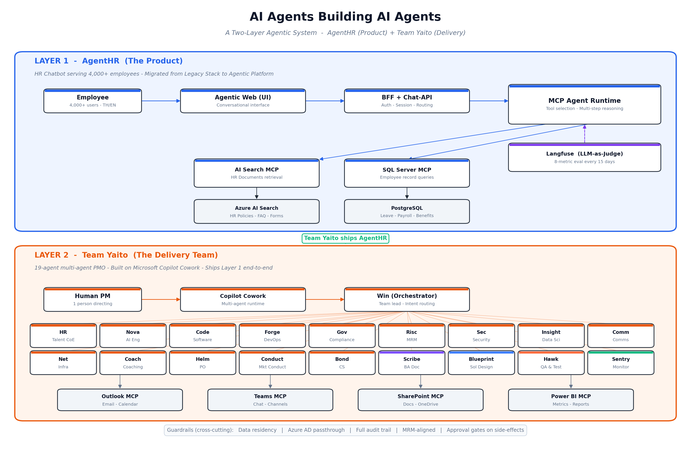

# Team Yaito — A Multi-Agent PMO on Microsoft Copilot Cowork

> Microsoft Agent Academy Hackathon · **Cowork Collective** track

Team Yaito is a multi-agent Project Management Office (PMO) built entirely on **Microsoft Copilot Cowork**. A single orchestrator agent (**Yaito**) coordinates **19 specialist agents** across five PMO functions to plan, govern, measure, and scale real enterprise program delivery — with a human accountable for every consequential action.

**Demo video (5 min):** https://youtu.be/Sri1vZOrUAw

---

## The Problem

Enterprise PMOs run program delivery on manual, fragmented work — status decks, scattered chat threads, and one-off spreadsheets. Planning, governance, and reporting consume senior PM time, knowledge lives in people's heads, and leadership lacks a real-time, defensible view of delivery health.

At **FinX Group**, a four-company financial-services organization serving **4,000+ employees**, a 30-day HR Chatbot migration ("**AgentHR**") needed PMO rigor that a single PM could not sustain alone.

**Target user:** Program and project managers in regulated enterprises who must plan, govern, measure, and scale complex delivery under tight deadlines — while keeping a human accountable for every decision.

---

## The Solution — Team Yaito

An orchestrator (**Yaito**) decomposes each request and delegates to **19 specialist agents** organized into five PMO functions. Agents act on live enterprise context through Cowork's tools (Outlook, Teams, SharePoint, Calendar) and route every write action through a human-in-the-loop approval dialog.

### Architecture
\

```
                    ┌─────────────────────────┐
   PM (natural  →   │   Orchestrator: Yaito    │
   language)        └────────────┬────────────┘
                                 │ delegates
        ┌──────────┬──────────┬──┴───────┬──────────┐
        ▼          ▼          ▼          ▼          ▼
     PLAN      ARCHITECT    GOVERN     MEASURE     SCALE
   (scoping,  (solution    (forums,   (metrics,   (reuse,
    schedule,  design,      approvals, quality,    follow-on
    risk)      decisions)   gates)     reporting)  agents)
        └──────────┴──────────┴──────────┴──────────┘
                                 │  via MCP tools
                                 ▼
        Microsoft Graph: Outlook · Teams · SharePoint · Calendar
                                 │
                                 ▼
                  Human-in-the-loop approval dialog
                  (nothing executes without confirmation)
```

| Function | What its agents do |
|----------|--------------------|
| **PLAN** | Scoping, scheduling, risk & dependency tracking |
| **ARCHITECT** | Solution design, technical decision records |
| **GOVERN** | Governance forums, approvals, compliance gates |
| **MEASURE** | Metrics, quality scoring, status reporting |
| **SCALE** | Reuse, follow-on agent creation, knowledge capture |

**Data flow:** Request → orchestrator → specialist agent → MCP tool retrieves/acts on tenant data → result returns to orchestrator → human approves → action commits.

---

## Key Technologies

- **Microsoft Copilot Cowork** — the runtime where all 19 agents live and execute
- **Microsoft Graph API** — how agents read and act on enterprise data across Outlook, Teams, SharePoint, and Calendar
- **Microsoft 365 Copilot** — grounding and reasoning over tenant context
- **Model Context Protocol (MCP)** — the tool interface connecting agents to Graph-backed services
- **Markdown + YAML agent definitions** — how each of the 19 agents is declared and configured

---

## How to Run

Team Yaito runs entirely inside Microsoft Copilot Cowork — there is no separate app to build or deploy.

1. Open **Microsoft Copilot Cowork** with an M365 account that has Outlook, Teams, SharePoint, and Calendar access.
2. Load the **Team Yaito agent set** — the orchestrator (Yaito) plus 19 specialist agents, each defined as a Markdown + YAML file in this repository.
3. Place the agent definition files in your Cowork agents folder so the orchestrator can route to them.
4. Start a conversation with Yaito in natural language (e.g., *"plan the AgentHR migration governance for this week"*). Yaito decomposes the request and delegates to the right specialist agents.
5. **Approve actions as they surface** — every send, post, schedule, or create routes through a human-in-the-loop approval dialog before it executes.

> No code, build step, or API keys are required.

---

## Results — AgentHR Proof Workload

On a real **30-day** HR-chatbot migration toward a **15 June 2026** go-live across four operating companies, Team Yaito delivered:

| Metric | Result |
|--------|--------|
| PMO staffing | Compressed a five-person PMO to **1 PM + 19 agents** |
| SQL correctness | **0.58 → 0.94** (+62 points) |
| Governance forums | **8 / 8** cleared |
| Follow-on agents seeded | **6** |
| Scope | 4,000+ employees · 4 operating companies |

---

## Design Principles

- **Orchestration over model cleverness** — value comes from decomposing a real PMO into the right specialist roles, not from a single large prompt.
- **Grounded, not generative** — agents reason over retrieved tenant context (emails, files, meetings) rather than free-form output.
- **Human-in-the-loop by design** — no consequential action executes without an approval dialog, making the system safe to run against a production tenant.

---

## Hackathon Submission

- **Track:** Cowork Collective
- **Submission type:** Individual
- **Demo video:** https://youtu.be/Sri1vZOrUAw

*Organization details masked as "FinX Group" for confidentiality. No confidential, proprietary, or sensitive information is included in this submission.*
